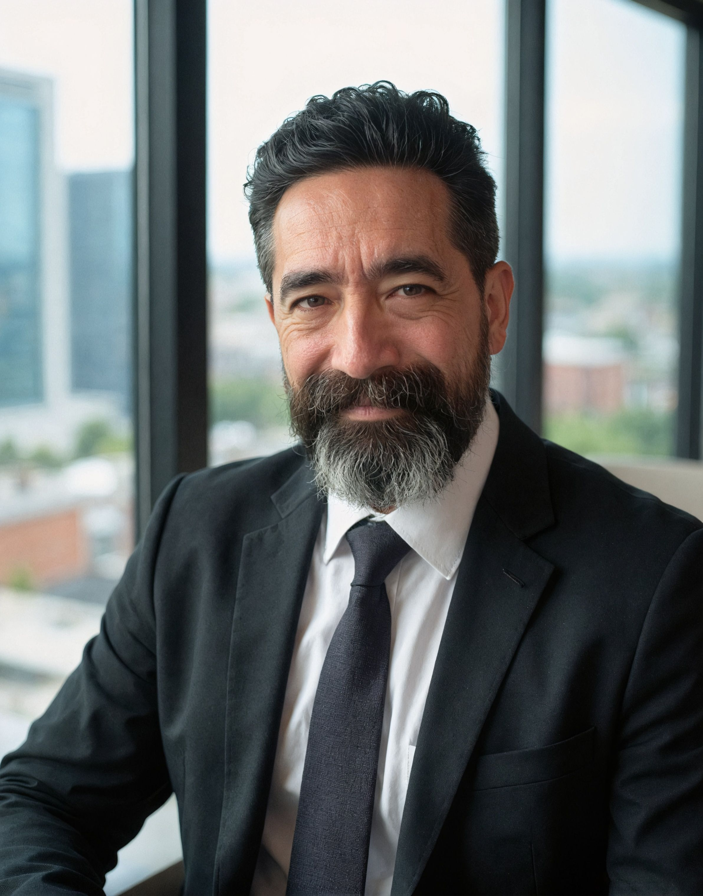

# Thomas C. Grow II
 

**Certified Chief AI Officer · AI Developer · LLM Integration & Python**
 
Certified Chief AI Officer (CAIO) — [World AI University](https://waiu.org)  
Charter Member & Teaching Faculty — [World AI Council](https://waicouncil.org)
 
---
 
One of the first people in the US to receive the CAIO certification. Currently shipping production Python and LLM systems while continuing fractional CAIO and AI strategy work. Governance-first by philosophy, pragmatic by nature.
 
---
 
### What I've Been Building
 
- Voice AI for healthcare revenue cycle management *(stealth startup, pilot live)*
- Prediction market analysis bot on Kalshi — 10 async agents, custom pub/sub event bus, Claude API integration, RSA-signed exchange auth, 35 automated tests *(private)*
- Multi-vendor inventory automation — Python/Playwright scraper keeping a client's Shopify catalog synced across multiple suppliers in real time *(private — client work)*
- [ResumeMatch](https://github.com/WarpedMind/resumematch) — CLI tool that scores a resume against a job description using the Claude API. Open source.
- [Foundry](https://github.com/WarpedMind/foundry) — open-source framework that gives AI coding sessions persistent memory, security guardrails, and honest governance scaffolding, so context and rules survive across sessions instead of resetting every time. Open source.
---
 
### Fractional CAIO & AI Strategy
 
I work with organizations on responsible AI adoption (including governance frameworks, risk assessments, regulatory compliance, ethics, and AI strategy). Clients include digital product studios, venture-backed startups, and teams moving into regulated industries.
 
I help teams move from "let's use AI" to an actual implementation plan that doesn't blow up in their face a year later.
 
Regulatory coverage: ISO 42001 · NIST AI RMF · EU AI Act · OMB M-25-21
 
The CAIO credential is useful on the dev side too. Teams building in regulated spaces (healthcare, finance, government, etc.) need someone who understands the governance layer, not just the API.
 
---
 
### Background
 
Started as a developer. Early work touched NASA's International Space Station, FAA Air Traffic Control systems, and Disney Imagineering, then network engineering, full-stack development, product management, and digital marketing. The path to CAIO and AI development wasn't linear, but it's all connected... kinda like my Obsidian second brain. 😄
 
---
 
### What You'll Find Here
 
| Repository | Description | Status |
|---|---|---|
| [resumematch](https://github.com/WarpedMind/resumematch) | CLI: score a resume against a JD using the Claude API | ✅ Active |
| [foundry](https://github.com/WarpedMind/foundry) | Framework scaffolding living docs, hooks, and security/governance guardrails for AI-assisted projects — plus Promptify (prompt rewriting) and qc-review (adversarial AI code review) | ✅ Active |
| [ai-governance-framework](https://github.com/WarpedMind/ai-governance-framework) | Practical AI governance templates, risk assessment tools, and adoption frameworks | ✅ Active |
| [caio-resources](https://github.com/WarpedMind/caio-resources) | CAIO certification materials, coursework notes, and AI executive reference content | 🚧 Coming soon |
 
---
 
Always up for a conversation about AI, governance, or whatever you're building.
 
📍 Orlando, FL · 🔗 [linkedin.com/in/tomgrow](https://linkedin.com/in/tomgrow)
